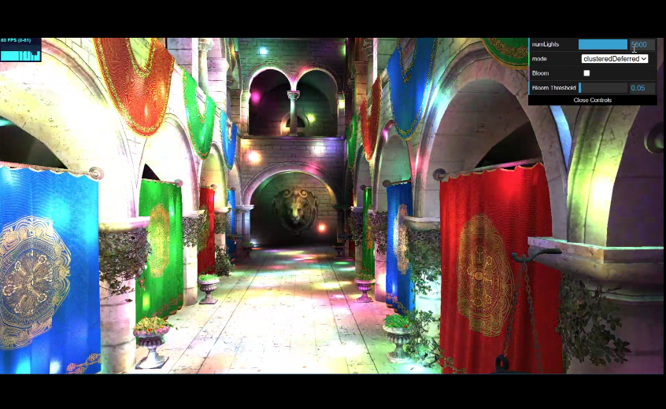
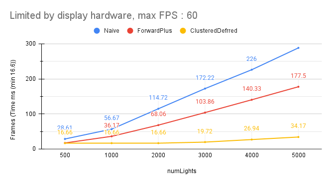
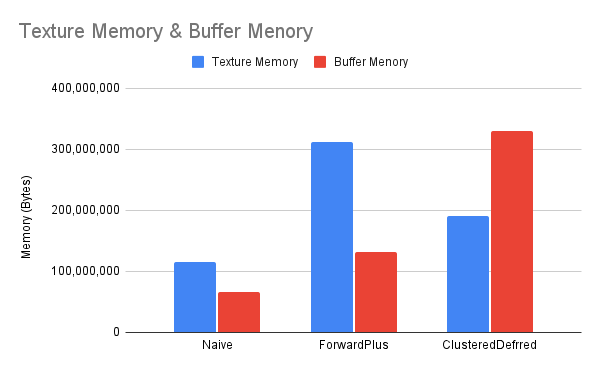

WebGL Forward+ and Clustered Deferred Shading
======================

**University of Pennsylvania, CIS 565: GPU Programming and Architecture, Project 4**

* Jiangman Zhao
* [Lobi Zhao - LinkedIn](https://www.linkedin.com/in/lobizhao/), [Lobi Zhao - personal website](https://lobizhao.github.io/).
* Tested on: **Google Chrome Version 141.0.7390.65**  on
  Windows 11 Pro, i5-10600KF @ 4.10GHz 32GB, RTX 3080 10GB

### Live Demo
- [Click Live Demo](https://lobizhao.github.io/Project4-WebGPU-Forward-Plus-and-Clustered-Deferred/) 👈

### Demo Video/GIF

### Features
#### Naive
Baseline forward rendering with no optimizations. Tests every light against every fragment, resulting in poor performance with many lights but simple implementation.

Workflow:
- Single render pass with brute-force lighting
- Test ALL lights against EVERY fragment
- **Complexity**: O(fragments × lights)

#### Forward Plus
Optimized forward rendering using light clustering. Divides screen into tiles and assigns lights to tiles, dramatically reducing per-fragment light tests while maintaining forward rendering benefits.

Workflow:
- Compute Pass: Assign lights to screen-space tiles (16×9 grid)
- Render Pass: For each fragment, determine tile and test only relevant lights

#### Clustered Deferred
Most efficient approach combining deferred shading with light clustering. Decouples geometry processing from lighting calculations, ideal for complex scenes with high light counts and overdraw.

Workflow:
- Compute Pass: Assign lights to screen-space tiles
- Buffer Pass: Render geometry data to textures (position, normal, albedo)
- Fullscreen Pass: Read G-Buffer, determine tile, calculate lighting only for visible pixels
- Advantage: Geometry processed once, lighting calculated only for visible pixels

#### Bloom

  
   
  Bloom - base on Box blur

Post-processing effect that creates realistic glow around bright light sources, enhancing visual quality and realism.

Workflow:
- Extract Pass: Isolate pixels brighter than threshold
- Blur Pass: Apply 11×11 box blur to bright areas
- Composite Pass: Blend blurred bloom with original scene

Implementation Files:
- `bloom_extract.fs.wgsl` - Extracts bright pixels above threshold using luminance calculation
- `bloom_blur.fs.wgsl` - Applies 11×11 box blur kernel for smooth glow effect
- `bloom_composite.fs.wgsl` - Combines original scene with blurred bloom (80% intensity)

### Analysis

#### Performance Comparison

  
   
  Performance Comparison: Frame Time vs Number of Lights

**Naive Rendering**: Exhibits the worst performance with linear scaling (O(n)). Frame time increases dramatically from 28.61ms (500 lights) to 288.33ms (5000 lights), making it unsuitable for scenes with many lights.

**Forward+**: Shows significant improvement over Naive through light clustering, reducing frame time by ~40% at 500 lights. However, performance still degrades linearly with light count, reaching 177.50ms at 5000 lights.

**Clustered Deferred**: Demonstrates superior performance and scalability. Maintains near-constant frame time (~16.66ms) up to 2000 lights due to deferred shading's ability to process only visible pixels. Even at 5000 lights (34.17ms), it outperforms Naive by 8.4× and Forward+ by 5.2×.

Clustered Deferred is the clear winner for high light count scenarios, maintaining consistent performance where other methods struggle. The G-Buffer approach eliminates redundant lighting calculations on occluded geometry, making it ideal for complex scenes with significant overdraw.

#### Memory Usage Analysis

  
   
  Memory Usage Comparison

**Naive**: Most memory-efficient (173.4 MB total) due to minimal data structures. Only stores basic scene geometry and lighting data without additional optimization structures.

**Forward+**: Moderate memory footprint (424.1 MB). Texture memory increases 2.7× due to screen-space tile data structures. Buffer memory doubles to store cluster-light assignments for the 16×9 tile grid.

**Clustered Deferred**: Highest memory usage (497.7 MB) but best performance. Texture memory (182.5 MB) stores G-Buffer (position, normal, albedo textures). Buffer memory (315.2 MB) is 5× larger than Naive due to cluster data structures and deferred rendering buffers.

Memory usage scales with optimization complexity. Clustered Deferred trades ~2.9× more memory than Naive for 8.4× better performance at high light counts, demonstrating an excellent performance-to-memory ratio for demanding scenes.

### Credits

- [Vite](https://vitejs.dev/)
- [loaders.gl](https://loaders.gl/)
- [dat.GUI](https://github.com/dataarts/dat.gui)
- [stats.js](https://github.com/mrdoob/stats.js)
- [wgpu-matrix](https://github.com/greggman/wgpu-matrix)
